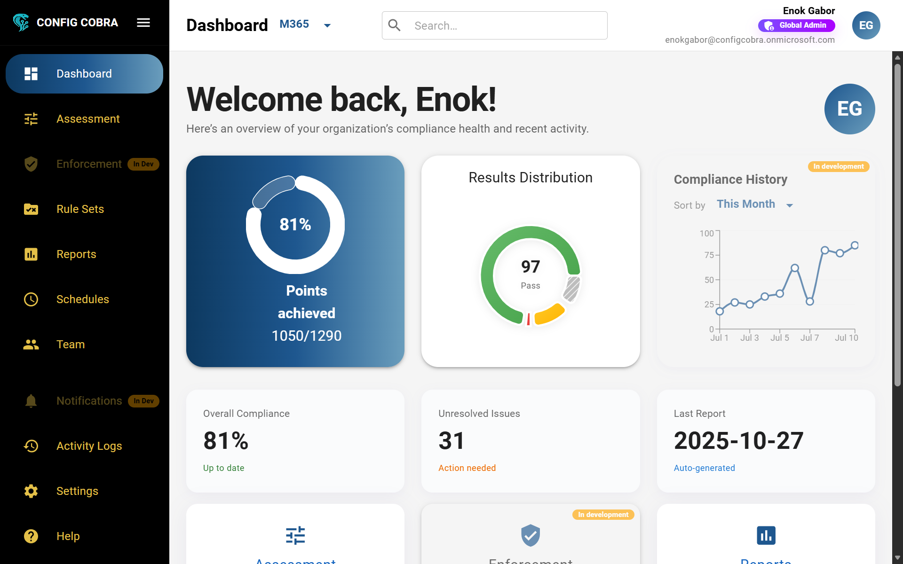

# ConfigCobra

**Automated CIS Compliance for Microsoft 365**

ConfigCobra is a SaaS application that automates [CIS Microsoft 365 Foundations Benchmark](https://www.cisecurity.org/benchmark/microsoft_365) **v7.0.0** assessments. We provide comprehensive theoretical mapping between CIS controls and 24+ security standards and frameworks, including SOC 2, NIS2, HIPAA, PCI DSS, ISO 27001, and many more. **Note:** Currently, ConfigCobra generates CIS-certified reports only. Framework-specific certified reports are planned for future releases.

Learn more at [configcobra.com](https://configcobra.com)

> 💬 **Questions, Bug Reports, or Feedback?**
> 
> Found a bug 🐛, have a question ❓, or want to share feedback 💡? Visit our [ConfigCobra Support](https://configcobra.com/#contact) page to report issues, ask questions, or share your suggestions. We appreciate your input and will do our best to respond promptly!

## 💡 What is ConfigCobra?

ConfigCobra automates CIS compliance scanning for Microsoft 365. It detects misconfigurations, provides remediation guidance, and generates audit-ready reports to help organizations stay compliant with security standards.

Visit [configcobra.com](https://configcobra.com) to learn more about our features and capabilities.

### ✨ Key Features

- ✅ **Automated Assessments** - Runs automated assessments of all 160 CIS controls (CIS Microsoft 365 Foundations Benchmark v7.0.0)
- ✅ **Real-time Detection** - Detects configuration drift in real-time
- ✅ **Remediation Guidance** - Provides clear remediation guidance for each finding
- ✅ **Audit-ready Reports** - Generates [CIS-approved](https://www.cisecurity.org/) PDF reports with evidence. [View Example Report](resources/images/ConfigCobraApp/Reports/ExampleReport.pdf)
- ✅ **Scheduled Monitoring** - Schedules continuous compliance monitoring
- ✅ **Team Collaboration** - Enables team collaboration and role management
- ✅ **Multi-Standard Mapping** - Theoretical mapping between CIS controls and 24+ security standards (see [Compliance Mapping](./docs/compliance-mapping.md))

## 🚀 Quick Start

Follow these simple steps to onboard your tenant with ConfigCobra and run your first CIS compliance assessment for Microsoft 365.

> ⚠️ **Important License Requirements**
> 
> CIS Benchmarks are based on **Microsoft 365 E3 and E5 licenses**. Although we can scan some controls without them, having some kind of **Microsoft Defender license** (Defender for Office 365, Defender for Endpoint, or Microsoft Defender XDR) is a **minimum requirement** for full functionality.

## 📋 Step-by-Step Setup Guide

> 📌 **Onboarding is handled by our team.** ConfigCobra is no longer listed on Microsoft AppSource — subscriptions are provisioned directly through a short Contact-Us onboarding. You'll need your **Microsoft 365 Tenant ID** to get started.

### Step 1: Contact ConfigCobra

Go to [configcobra.com/contact](https://configcobra.com/contact) (or email **info@configcobra.com**) and include:

- Your **Microsoft 365 Tenant ID** (the GUID of the tenant you want to assess)
- The number of **licensed Microsoft 365 users** in that tenant (excluding guest users)
- The plan you're interested in (Small / Medium / Large / Enterprise / MSP Assessment License / free trial)

> 💡 **How to find your Tenant ID:** Sign in to the [Microsoft Entra admin center](https://entra.microsoft.com), go to **Identity → Overview**, and copy the **Tenant ID** field. See Microsoft's guide: [How to find your Microsoft 365 tenant ID](https://learn.microsoft.com/entra/fundamentals/how-to-find-tenant).

### Step 2: We activate your tenant

Once we receive your request, our team validates the tenant and provisions your workspace. You'll get a confirmation email — usually within one business day — with your login link and next steps.

### Step 3: Log in to ConfigCobra

Head to [app.configcobra.com](https://app.configcobra.com) and sign in with your Microsoft 365 account using Single Sign-On.

### Step 4: Accept admin consent

Accept all the permissions on the admin consent page. This is required for ConfigCobra to read your Microsoft 365 configuration through Microsoft Graph (read-only).

### Step 5: Configure missing role permissions

After login, go to the **Assessment page**. You will see some controls that have a **Missing Permissions** blue tag.

**If you are an administrator:**
- Click the control, then press **"ASSIGN"** to automatically assign the required roles and permissions

**If you are a regular user:**
- Press **"DO IT MANUALLY"** and send the instructions to your global administrator to grant the necessary permissions

  

## ✅ You're Ready!

Once you've completed all the steps above, you can navigate to the Assessment page and start running your first CIS compliance scan. ConfigCobra will automatically check your Microsoft 365 configurations against CIS Benchmark standards.

For more information and resources, visit [configcobra.com](https://configcobra.com).

## 📚 Documentation

### Core Features

- 📖 **[Getting Started](./docs/getting-started.md)** - Complete onboarding guide from Contact Us to first assessment
- 🎯 **[Assessments](./docs/assessments.md)** - How to run CIS compliance assessments and understand results
- 📄 **[Reports & Evidence](./docs/reports.md)** - View, download, and understand CIS-approved assessment reports
- 📋 **[Rule Sets](./docs/rule-sets.md)** - Create custom collections of CIS controls for your organization
- ⏰ **[Scheduled Scans](./docs/schedules.md)** - Automate compliance assessments with daily, weekly, or monthly runs
- 🔔 **[Notifications & Settings](./docs/notifications.md)** - Configure notifications and customize your experience
- 👥 **[User Management](./docs/user-management.md)** - Manage team access and permissions with Azure Entra integration

### Additional Resources

- 📊 **[Compliance Mapping](./docs/compliance-mapping.md)** - Detailed mapping between CIS M365 and 24+ security standards
- 🏥 **[Use Cases](./use-cases/)** - Industry-specific use cases and implementation examples:
  - [Healthcare](./use-cases/healthcare.md) - HIPAA compliance for healthcare providers
  - [Financial Services](./use-cases/financial-services.md) - PCI DSS and financial regulations
  - [Government Contractors](./use-cases/government-contractor.md) - CMMC and NIST frameworks
  - [Enterprise Multi-Standard](./use-cases/enterprise-compliance.md) - Managing multiple compliance frameworks
- 📝 **[Changelog](./CHANGELOG.md)** - Version history and release notes
- 🤝 **[Contributing](./CONTRIBUTING.md)** - Guidelines for reporting bugs and requesting features

## 🔍 What ConfigCobra Does

### 🔐 Automated Compliance Scanning

ConfigCobra automatically assesses your Microsoft 365 environment against CIS Benchmark standards. The platform:

- 🔎 Scans all 160 CIS controls for [Microsoft 365 Foundations Benchmark v7.0.0](https://www.cisecurity.org/benchmark/microsoft_365)
- 🚨 Detects misconfigurations and security gaps
- 📝 Provides detailed remediation instructions
- 📊 Generates audit-ready PDF reports ([Example Report](resources/images/ConfigCobraApp/Reports/ExampleReport.pdf))

### 🌍 Multi-Standard Compliance Mapping

ConfigCobra provides comprehensive **theoretical mapping** between CIS Microsoft 365 Foundations Benchmark controls and various security standards. While we currently generate **CIS-certified reports only**, our compliance mapping helps you understand how CIS assessments relate to other frameworks. See our [Compliance Mapping](./docs/compliance-mapping.md) documentation for details.

**Supported mappings include:**
- **SOC 2** - Service Organization Control 2
- **NIS2** - EU Network and Information Systems Directive 2
- **HIPAA** - Health Insurance Portability and Accountability Act
- **PCI DSS** - Payment Card Industry Data Security Standard
- **ISO 27001** - Information Security Management System
- And 19+ more standards and frameworks

**📊 See the complete mapping table:** [Compliance Mapping](./docs/compliance-mapping.md)

**Note:** Framework-specific certified reports are planned for future releases. Currently, CIS-certified reports can be used alongside the mapping to support compliance with other standards.

### 📊 Assessment Results

Each assessment provides detailed information including:

- ✅ **Outcome** - Pass, Fail, or Warning status
- 📖 **Description** - Detailed explanation of the control
- ⚠️ **Impact** - Security and compliance implications
- 🔍 **Audit** - Evidence and audit trail information
- 🛠️ **Remediation** - Step-by-step instructions to fix issues
- ⚙️ **Configuration** - Current settings in your tenant

## 💬 Support

For questions, issues, or support requests, please contact us at **info@digitechold.com** or visit [configcobra.com](https://configcobra.com) for more information.

You can also report bugs 🐛, ask questions ❓, or share feedback 💡 on our [ConfigCobra Support](https://configcobra.com/#contact) page.

## 🔗 Links

- 🌐 **Application**: [app.configcobra.com](https://app.configcobra.com)
- 🌍 **Website**: [configcobra.com](https://configcobra.com)
- ✉️ **Onboarding**: [configcobra.com/contact](https://configcobra.com/contact) · **info@configcobra.com**
- 🏆 **CIS Benchmark**: [CIS Microsoft 365 Foundations Benchmark v7.0.0](https://www.cisecurity.org/benchmark/microsoft_365)
- 💬 **Support**: [Report Issues & Questions](https://configcobra.com/#contact)

---

**ConfigCobra** - Automated CIS Compliance for Microsoft 365 | [configcobra.com](https://configcobra.com)
