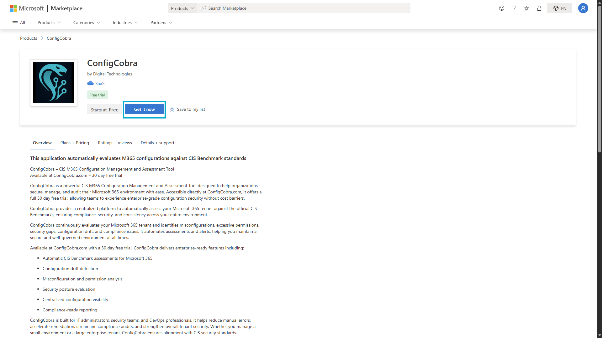
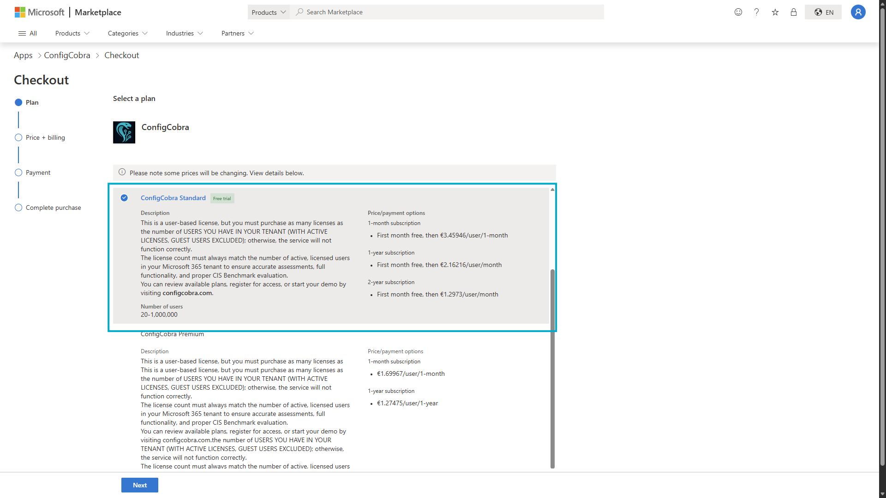
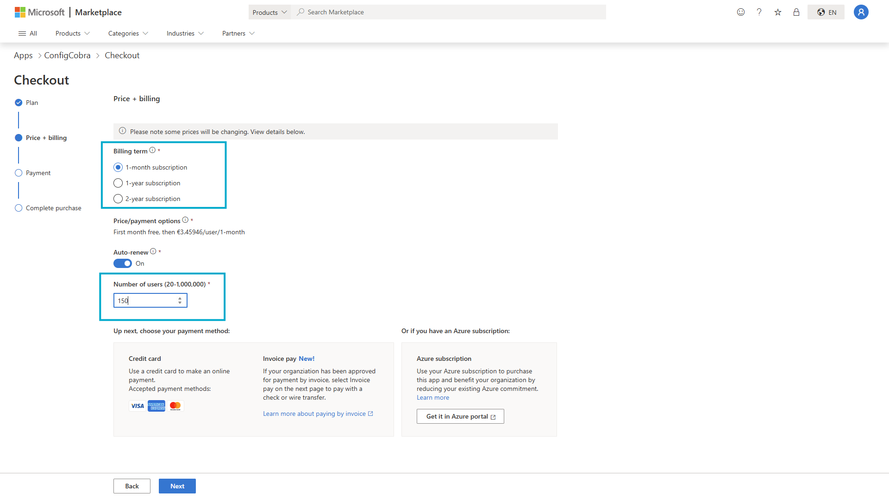
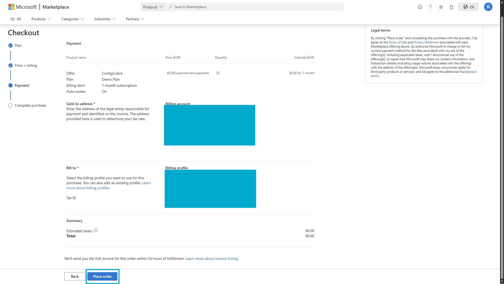
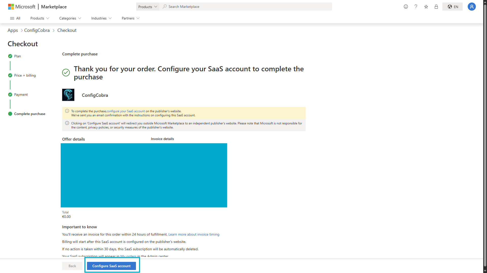
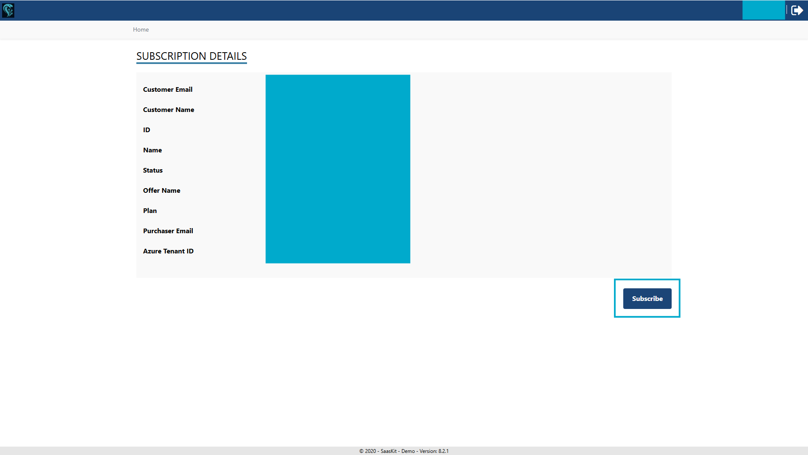
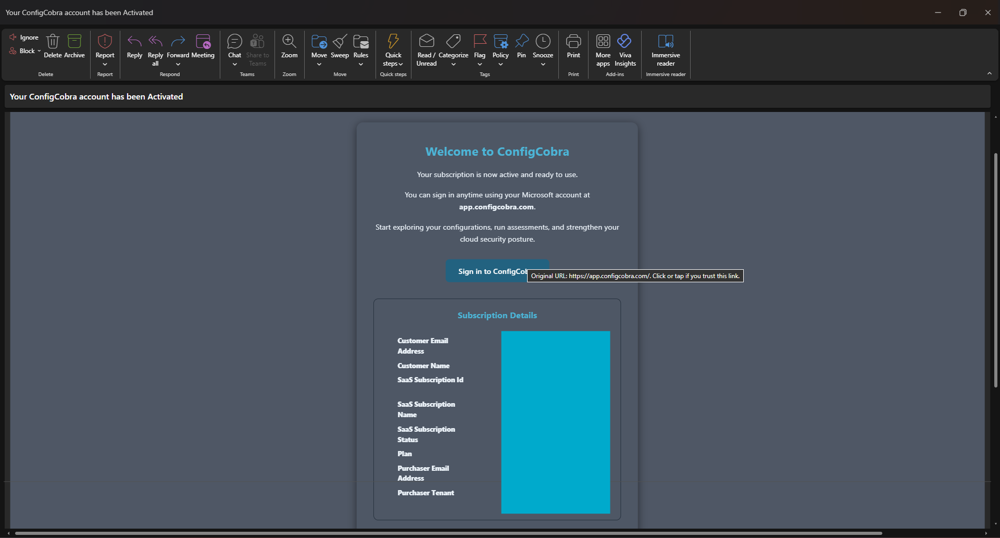
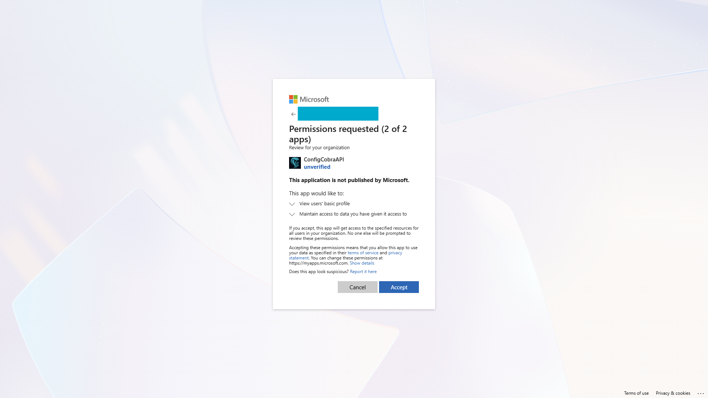

# ConfigCobra

**Automated CIS Compliance for Microsoft 365**

ConfigCobra is a SaaS application that automates CIS Microsoft 365 Foundations Benchmark assessments. We provide comprehensive mapping and compliance coverage across multiple security standards and frameworks, including SOC 2, NIS2, HIPAA, PCI DSS, ISO 27001, and many more.

Learn more at [configcobra.com](https://configcobra.com)

> 💬 **Questions, Bug Reports, or Feedback?**
> 
> Found a bug 🐛, have a question ❓, or want to share feedback 💡? Visit our [GitHub Issues](https://github.com/Digital-Technologies-Holding/ConfigCobra/issues) or [ConfigCobra Contact](https://configcobra.com/contact) page to report issues, ask questions, or share your suggestions. We appreciate your input and will do our best to respond promptly!

## 💡 What is ConfigCobra?

ConfigCobra automates CIS compliance scanning for Microsoft 365. It detects misconfigurations, provides remediation guidance, and generates audit-ready reports to help organizations stay compliant with security standards.

Visit [configcobra.com](https://configcobra.com) to learn more about our features and capabilities.

### ✨ Key Features

- ✅ **Automated Assessments** - Runs automated assessments of all 129 CIS controls
- ✅ **Real-time Detection** - Detects configuration drift in real-time
- ✅ **Remediation Guidance** - Provides clear remediation guidance for each finding
- ✅ **Audit-ready Reports** - Generates CIS-approved PDF reports with evidence
- ✅ **Scheduled Monitoring** - Schedules continuous compliance monitoring
- ✅ **Team Collaboration** - Enables team collaboration and role management
- ✅ **Multi-Standard Support** - Comprehensive mapping across 24+ security standards

## 🚀 Quick Start

Follow these simple steps to set up ConfigCobra and run your first CIS compliance assessment for Microsoft 365.

> ⚠️ **Important License Requirements**
> 
> CIS Benchmarks are based on **Microsoft 365 E3 and E5 licenses**. Although we can scan some controls without them, having some kind of **Microsoft Defender license** (Defender for Office 365, Defender for Endpoint, or Microsoft Defender XDR) is a **minimum requirement** for full functionality.

## 📋 Step-by-Step Setup Guide

### Step 1: Get started on Microsoft AppSource

Visit the [Microsoft AppSource marketplace](https://marketplace.microsoft.com/en-us/product/saas/nologiesholdingkorltoltfelelssgtrsasg1726131505636.config_cobra_01?tab=Overview) to acquire your ConfigCobra subscription.

1. Go to Microsoft AppSource and press **"Get it now"**

   

2. To acquire a free trial, please select the **Standard** plan

   

### Step 2: Provide your user count

Enter the number of licensed users in your organization. **This is important** because the application only works if you have that many licenses as many licensed users you have (excluded guest users).

### Step 3: Complete your order

Select your billing account and billing profile, then place your order through the Microsoft AppSource checkout process.

### Step 4: Activate your subscription

Follow the activation link to our fulfillment platform and activate your subscription. This link will be provided after you complete your purchase on Microsoft AppSource.

### Step 5: Receive confirmation email

Once your subscription is activated by our team, you will receive a confirmation email with your login credentials and next steps.

### Step 6: Log in to ConfigCobra

Head to [app.configcobra.com](https://app.configcobra.com) and log in using the credentials from your confirmation email.

### Step 7: Accept permissions

Accept all the permissions on the admin consent page. This is required for ConfigCobra to access and assess your Microsoft 365 configurations.

### Step 8: Configure missing permissions

After login, go to the **Assessment page**. You will see some controls that have a **Missing Permissions** blue tag.

**If you are an administrator:**
- Select all permissions as an administrator and activate them

**If you are a regular user:**
- Send the instructions provided in the **Do It Manually** section to your global administrator to grant the necessary permissions

  

## ✅ You're Ready!

Once you've completed all the steps above, you can navigate to the Assessment page and start running your first CIS compliance scan. ConfigCobra will automatically check your Microsoft 365 configurations against CIS Benchmark standards.

For more information and resources, visit [configcobra.com](https://configcobra.com).

## 📚 Documentation

### Core Features

- 📖 **[Getting Started](./getting-started.md)** - Complete setup guide from subscription to first assessment
- 🎯 **[Assessments](./assessments.md)** - How to run CIS compliance assessments and understand results
- 📄 **[Reports & Evidence](./reports.md)** - View, download, and understand CIS-approved assessment reports
- 📋 **[Rule Sets](./rule-sets.md)** - Create custom collections of CIS controls for your organization
- ⏰ **[Scheduled Scans](./schedules.md)** - Automate compliance assessments with daily, weekly, or monthly runs
- 🔔 **[Notifications & Settings](./notifications.md)** - Configure notifications and customize your experience
- 👥 **[User Management](./user-management.md)** - Manage team access and permissions with Azure Entra integration

## 🔍 What ConfigCobra Does

### 🔐 Automated Compliance Scanning

ConfigCobra automatically assesses your Microsoft 365 environment against CIS Benchmark standards. The platform:

- 🔎 Scans all 129 CIS controls for Microsoft 365 Foundations Benchmark
- 🚨 Detects misconfigurations and security gaps
- 📝 Provides detailed remediation instructions
- 📊 Generates audit-ready PDF reports

### 🌍 Multi-Standard Compliance

Beyond CIS Benchmarks, ConfigCobra provides comprehensive mapping and compliance coverage across multiple security standards:

- **SOC 2** - Service Organization Control 2 compliance
- **NIS2** - EU Network and Information Systems Directive 2
- **HIPAA** - Health Insurance Portability and Accountability Act
- **PCI DSS** - Payment Card Industry Data Security Standard
- **ISO 27001** - Information Security Management System
- And 19+ more standards and frameworks

### 📊 Assessment Results

Each assessment provides detailed information including:

- ✅ **Outcome** - Pass, Fail, or Warning status
- 📖 **Description** - Detailed explanation of the control
- ⚠️ **Impact** - Security and compliance implications
- 🔍 **Audit** - Evidence and audit trail information
- 🛠️ **Remediation** - Step-by-step instructions to fix issues
- ⚙️ **Configuration** - Current settings in your tenant

## 💬 Support

For questions, issues, or support requests, please contact us at **info@digitechold.com** or visit [configcobra.com](https://configcobra.com) for more information.

You can also report bugs 🐛, ask questions ❓, or share feedback 💡 on our [GitHub Issues](https://github.com/Digital-Technologies-Holding/ConfigCobra/issues) page.

## 🔗 Links

- 🌐 **Application**: [app.configcobra.com](https://app.configcobra.com)
- 🌍 **Website**: [configcobra.com](https://configcobra.com)
- 🛒 **Microsoft AppSource**: [Get ConfigCobra](https://marketplace.microsoft.com/en-us/product/saas/nologiesholdingkorltoltfelelssgtrsasg1726131505636.config_cobra_01?tab=Overview)
- 💬 **GitHub Issues**: [Report Issues & Questions](https://github.com/Digital-Technologies-Holding/ConfigCobra/issues)

---

**ConfigCobra** - Automated CIS Compliance for Microsoft 365 | [configcobra.com](https://configcobra.com)

