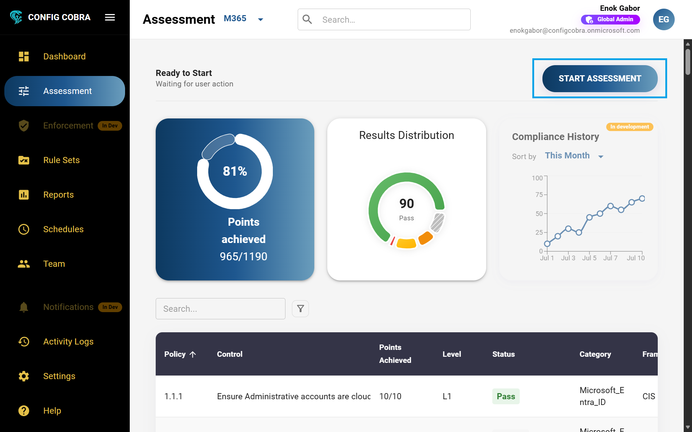
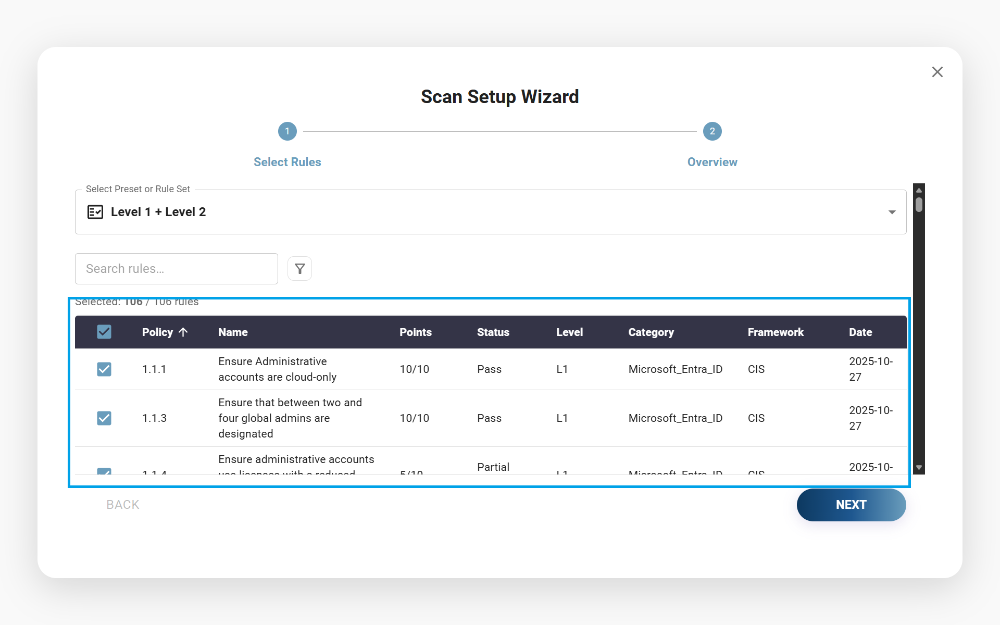
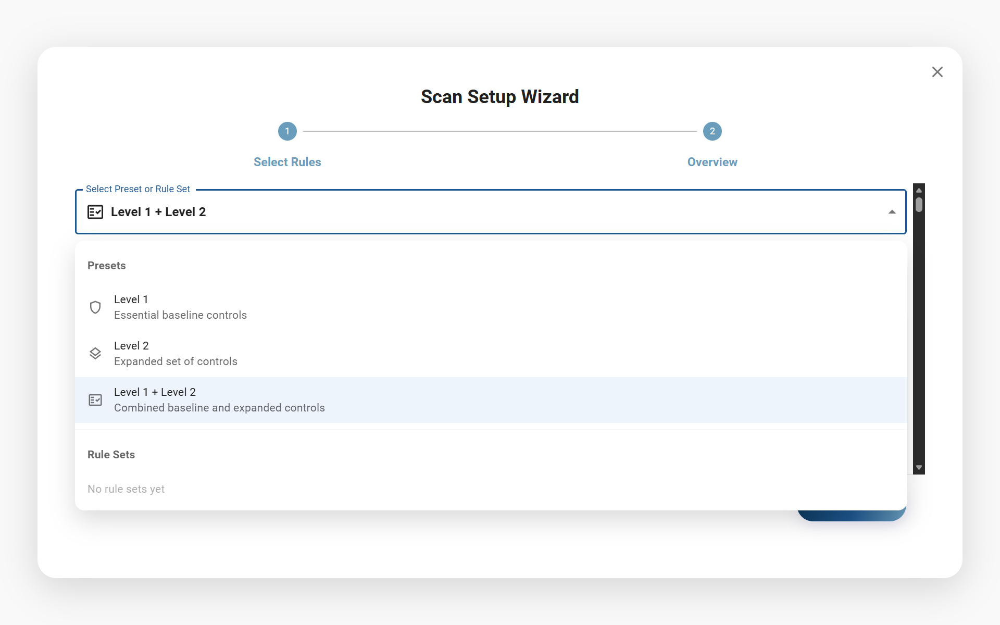
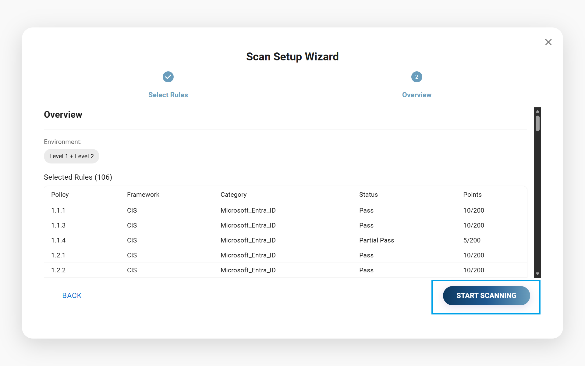
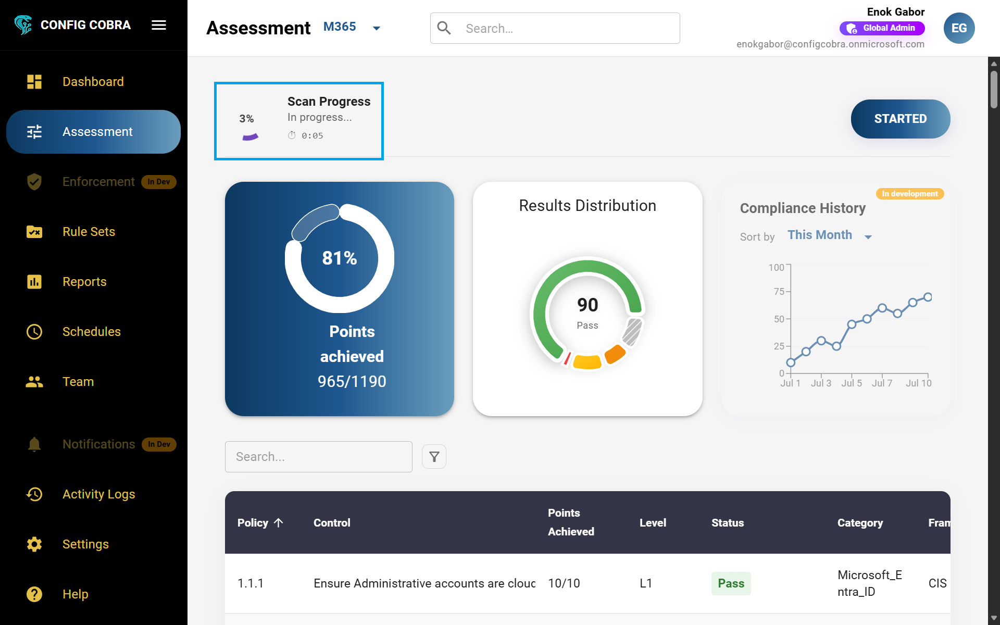
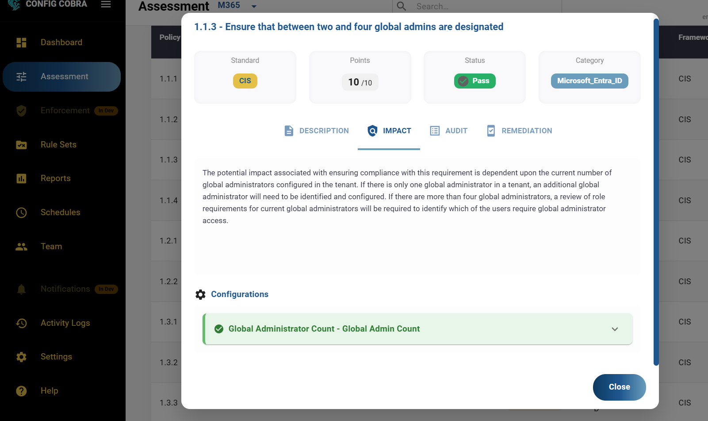

# 🎯 Running CIS Compliance Assessments

Learn how to configure and run automated CIS Benchmark assessments for Microsoft 365, view results, and understand compliance findings.

## 📋 Overview

The Assessment feature allows you to run **ad-hoc (manual)** CIS compliance scans on your Microsoft 365 environment. You can select specific benchmarks, rule sets, or run comprehensive assessments covering all CIS controls.

**📝 Note:** This page is for running **ad-hoc/manual assessments** on-demand. To set up **automated scheduled assessments**, see the [Scheduled Scans](./schedules.md) documentation.

For more information, visit [configcobra.com](https://configcobra.com).

## 🚀 How to Run an Ad-Hoc Assessment

This section explains how to run **manual (ad-hoc) assessments** on-demand. For automated scheduled assessments, see [Scheduled Scans](./schedules.md).

### Step 1: 🔐 Log in to ConfigCobra

Log in at [app.configcobra.com](https://app.configcobra.com) using your credentials.

### Step 2: 📍 Navigate to Assessment tab

Go to the **Assessment** tab in the main navigation menu.

### Step 3: ▶️ Start a new assessment

Press **"Start Assessment"** in the right corner of the Assessment page.

### Step 4: 📊 Select your benchmarks

Select the desired benchmarks you want to assess. You can choose from:

- **Level 1** 🔒 – Essential security controls recommended for all systems
- **Level 2** 🛡️ – Enhanced security controls for sensitive environments
- **Both Level 1 and Level 2** benchmarks
- **Predefined rule sets** 📋 – Learn more about [rule sets](./rule-sets.md)
- **Custom selection by benchmark** ⚙️

### Step 5: 👀 Review and start scanning

You will see an **Overview page** of your scan configuration, showing:

- ✅ Selected benchmarks and rule sets
- ⏱️ Estimated scan duration
- 🔍 Controls that will be assessed

If you are happy with the configuration, press **START SCANNING** to begin the assessment.

### Step 6: ⏳ Wait for results

After starting the scan, ConfigCobra will automatically assess your Microsoft 365 configurations. The process typically takes:

**⏱️ 20-25 minutes** depending on your user count. Larger organizations may experience longer scan times.

Once complete, you will be able to see the results on the **Assessment page** as well as on the [Reports page](./reports.md).

## 📊 Understanding Assessment Results

After an assessment is complete, by clicking on each benchmark you can see detailed information including:

### ✅ Outcome
Pass, Fail, or Warning status

### 📖 Description
Detailed explanation of the control

### ⚠️ Impact
Security and compliance implications

### 🔍 Audit
Evidence and audit trail information

### 🛠️ Remediation
Step-by-step instructions to fix issues

### ⚙️ Configuration
Current settings in your tenant

## 📜 Assessment History

**⚠️ Important:** On the Assessment page, you can only see your **last assessment** at any given time. To view historical assessments and compare results over time, visit the [Reports page](./reports.md).

## Assessment Outcomes

Reports display three different types of outcomes for each control assessment:

### ✅ Pass
The control is fully compliant with the CIS Benchmark requirement. All configuration settings meet the specified criteria.

### ❌ Fail
The control does not meet the CIS Benchmark requirement. One or more configuration settings are not compliant and require remediation.

### ⚠️ Partial Pass
The control partially meets the CIS Benchmark requirement. Some configuration settings are compliant, but others need attention.

## 💡 Best Practices

- 🔄 Run assessments regularly to track compliance over time
- 🎯 Start with Level 1 benchmarks for initial assessments
- 📋 Use rule sets to focus on critical controls
- 🔍 Review remediation guidance for failed controls
- ⏰ Schedule automated assessments for continuous monitoring

---

[← Back to Documentation](../README.md) | [Next: Reports →](./reports.md)

