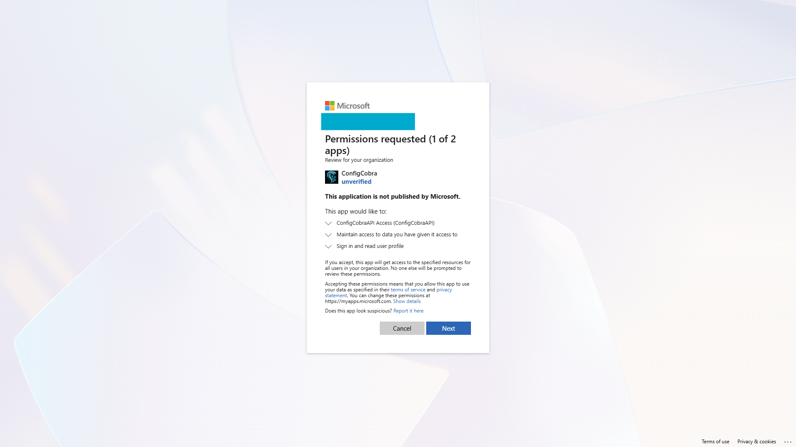
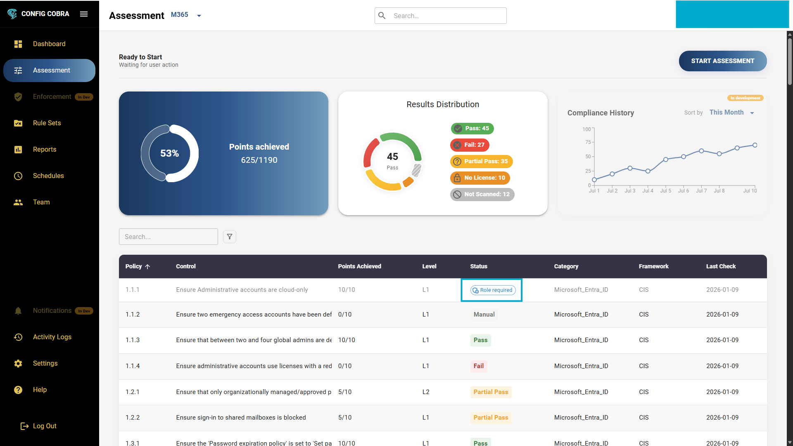
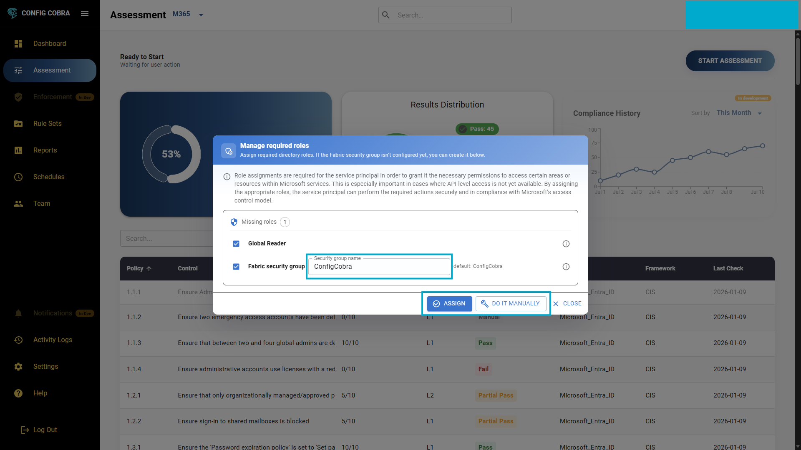

# Getting Started with ConfigCobra

Follow these simple steps to onboard your tenant with ConfigCobra and run your first CIS compliance assessment for Microsoft 365.

Learn more at [configcobra.com](https://configcobra.com)

> ⚠️ **Important License Requirements**
> 
> CIS Benchmarks are based on **Microsoft 365 E3 and E5 licenses**. Although we can scan some controls without them, having some kind of **Microsoft Defender license** (Defender for Office 365, Defender for Endpoint, or Microsoft Defender XDR) is a **minimum requirement** for full functionality.

> 📌 **Onboarding is handled by our team.** ConfigCobra is no longer listed on Microsoft AppSource — subscriptions are provisioned directly through a short Contact-Us onboarding. You'll need your **Microsoft 365 Tenant ID** to get started.

## Step-by-Step Setup Guide

### Step 1: Contact ConfigCobra

Go to [configcobra.com/contact](https://configcobra.com/contact) (or email **info@configcobra.com**) and include:

- Your **Microsoft 365 Tenant ID** (the GUID of the tenant you want to assess)
- The number of **licensed Microsoft 365 users** in that tenant (excluding guest users)
- The plan you're interested in (Small / Medium / Large / Enterprise / MSP Assessment License / free trial)

> 💡 **How to find your Tenant ID:** Sign in to the [Microsoft Entra admin center](https://entra.microsoft.com), go to **Identity → Overview**, and copy the **Tenant ID** field. See Microsoft's guide: [How to find your Microsoft 365 tenant ID](https://learn.microsoft.com/entra/fundamentals/how-to-find-tenant).

### Step 2: We activate your tenant

Once we receive your request, our team validates the tenant and provisions your workspace. You'll get a confirmation email — usually within one business day — with your login link and next steps.

### Step 3: Log in to ConfigCobra

Head to [app.configcobra.com](https://app.configcobra.com) and sign in with your Microsoft 365 account using Single Sign-On.

### Step 4: Accept admin consent

Accept all the permissions on the admin consent page. This is required for ConfigCobra to read your Microsoft 365 configuration through Microsoft Graph (read-only).

### Step 5: Configure missing role permissions

After login, go to the **Assessment page**. You will see some controls that have a **Missing Permissions** blue tag.

**If you are an administrator:**
- Click the control, then press **"ASSIGN"** to automatically assign the required roles and permissions

**If you are a regular user:**
- Press **"DO IT MANUALLY"** and send the instructions to your global administrator to grant the necessary permissions

  

## You're Ready!

Once you've completed all the steps above, you can navigate to the Assessment page and start running your first CIS compliance scan. ConfigCobra will automatically check your Microsoft 365 configurations against CIS Benchmark standards.

Visit [configcobra.com](https://configcobra.com) for additional resources and support.

## Next Steps

- Learn how to [run assessments](./assessments.md)
- Understand [assessment results](./reports.md)
- Create [custom rule sets](./rule-sets.md)
- Set up [scheduled scans](./schedules.md)

---

[← Back to Documentation](../README.md) | [Next: Assessments →](./assessments.md)
