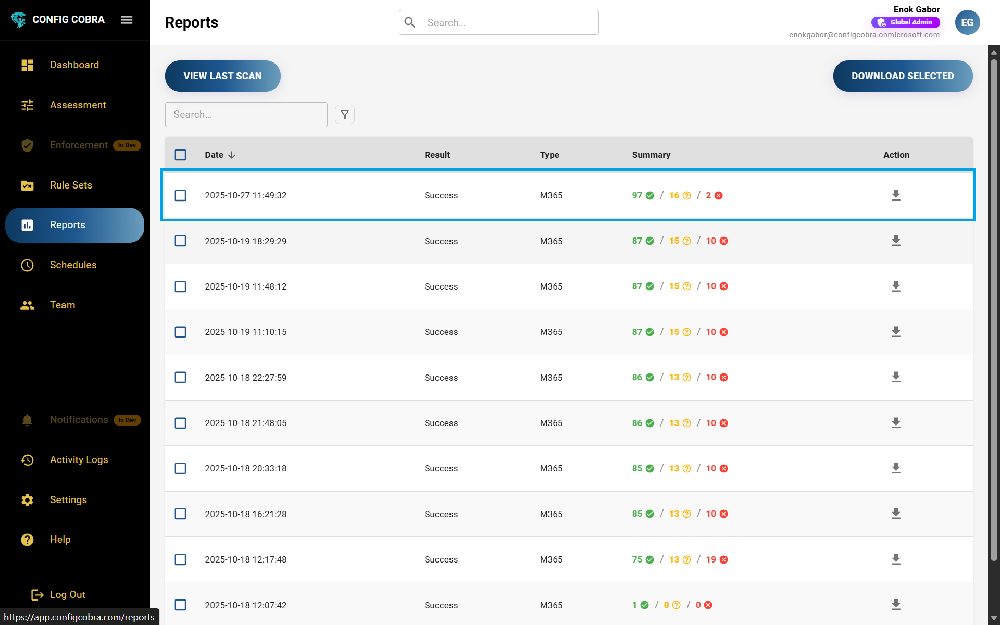
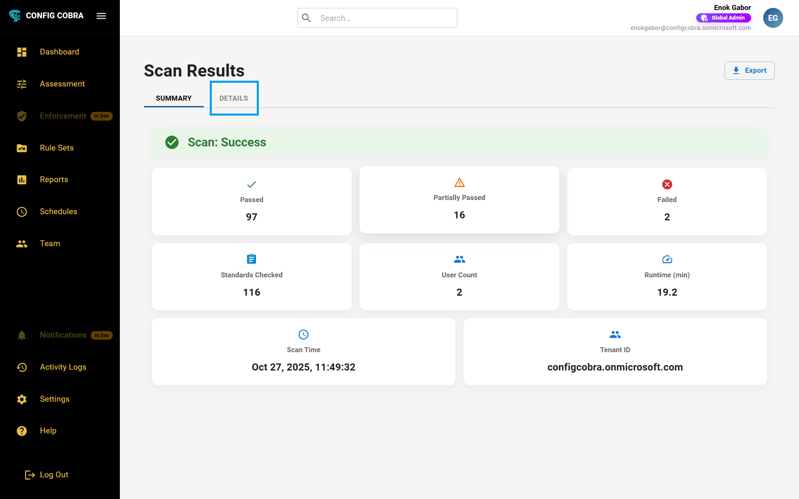
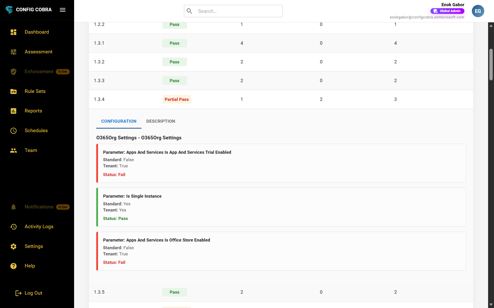

# 📄 Reports & Evidence

Access, download, and understand your CIS-approved assessment reports for compliance audits and documentation.

Learn more at [configcobra.com](https://configcobra.com)

## 📋 What are Reports?

Reports are **✅ CIS-approved and certified** documents that can be downloaded as **📄 PDF files** and presented as **📊 proof during an audit**. These comprehensive reports provide detailed evidence of your organization's compliance status with CIS Benchmark standards for Microsoft 365.

**🎯 Audit-ready:** ConfigCobra reports are designed to meet audit requirements and can be directly submitted to auditors, compliance teams, or stakeholders as official documentation of your security posture.

## 🚀 How to Access Reports

### Step 1: 🔐 Log in to ConfigCobra

Log in at [app.configcobra.com](https://app.configcobra.com) using your credentials.

### Step 2: 📍 Navigate to Reports page

Go to the **Reports** tab where you can see all of your past assessments (both **🤖 automated** and **✋ manual**). Learn more about [how to run an assessment](./assessments.md) or about [scheduled scans](./schedules.md).

### Step 3: 👀 View assessment outcomes

You can see the outcomes of each assessment displayed in the reports list, including the assessment date 📅, benchmark type 📊, and overall compliance status ✅.

### Step 4: 📥 Download reports

You can download any report using the **action button** on the right side of each report. Reports are available as **✅ CIS-approved and certified PDF files** that can be presented as proof during audits.

**📄 Example Report:** [View Example CIS-Approved Report](../images/ConfigCobraApp/Reports/ExampleReport.pdf)

### Step 5: 🔍 Explore report details

Opening up a report, you can see:

- **📊 Summary tab** – Overview of the assessment results, compliance scores, and key findings
- **📋 Details tab** – Results organized by benchmark. Opening each benchmark shows the individual control results and the **⚙️ configurations in your tenant**

## 🎯 Understanding Assessment Outcomes

Reports display three different types of outcomes for each control assessment. Understanding these outcomes helps you prioritize remediation efforts and track your compliance progress.

### ✅ Pass
The control is fully compliant with the CIS Benchmark requirement. All configuration settings meet the specified criteria.

### ❌ Fail
The control does not meet the CIS Benchmark requirement. One or more configuration settings are not compliant and require remediation.

### ⚠️ Partial Pass
The control partially meets the CIS Benchmark requirement. Some configuration settings are compliant, but others need attention.

## 📋 Report Structure

### 📊 Summary Tab
High-level overview including:
- 📈 Compliance scores
- 🔢 Total controls assessed
- ✅ Pass/fail/partial pass counts
- 💡 Key recommendations

### 📋 Details Tab
Detailed results organized by benchmark. Each benchmark can be expanded to view:
- 🔍 Individual control results
- ⚙️ Configurations in your tenant
- 🛠️ Remediation steps
- 📄 Audit evidence

## 🎯 Use Cases

- **📊 Compliance Audits** - Submit reports as evidence of compliance
- **👔 Executive Reporting** - Share high-level compliance status with leadership
- **🛠️ Remediation Planning** - Use detailed findings to prioritize fixes
- **📈 Historical Tracking** - Compare results over time to measure improvement
- **📄 Documentation** - Maintain records of compliance assessments

## 💡 Best Practices

- 📥 Download reports after each assessment for record-keeping
- 👀 Review summary tab for quick compliance overview
- 🔍 Use details tab to understand specific control failures
- 🤝 Share reports with stakeholders for transparency
- 📚 Archive reports for audit trail purposes

---

[← Back to Documentation](../README.md) | [Next: Rule Sets →](./rule-sets.md)

