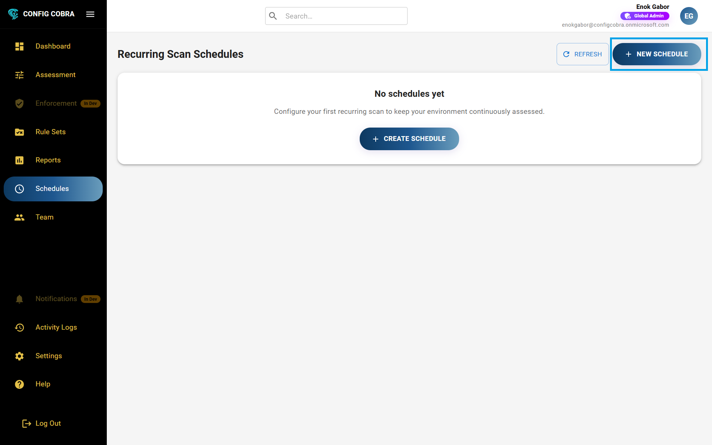
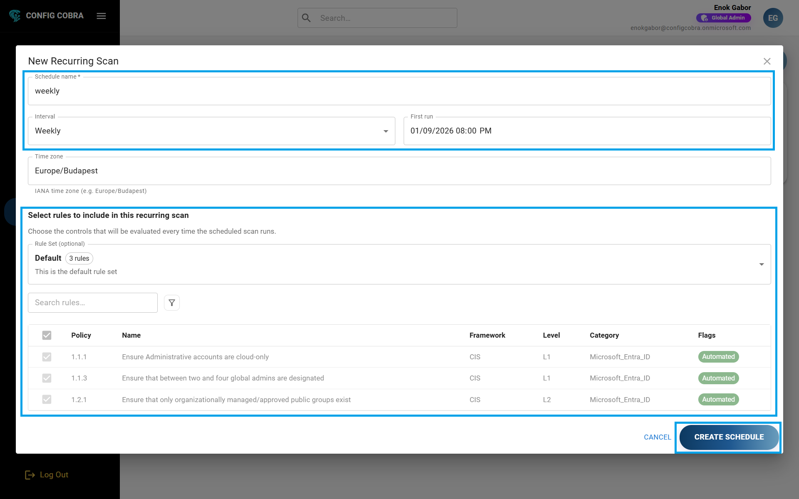
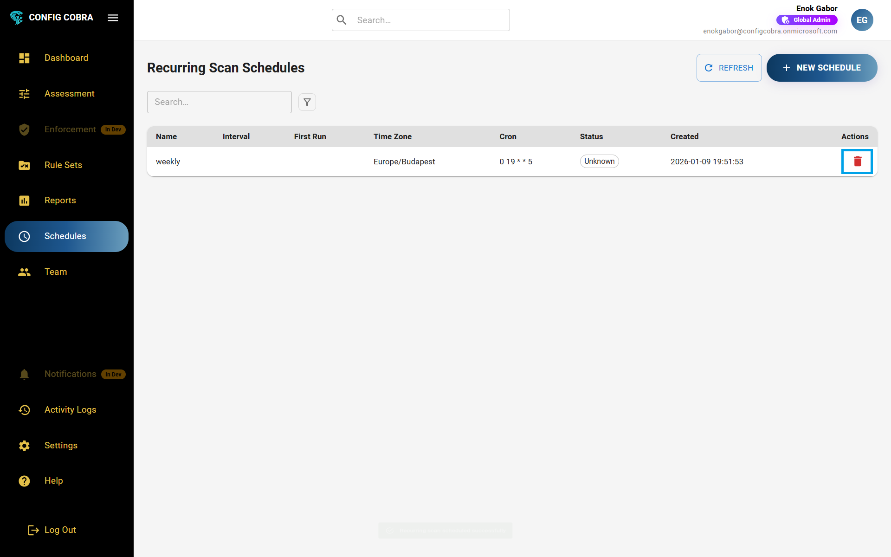

# ⏰ Scheduled Assessments

Automate your compliance assessments by scheduling regular CIS Benchmark scans with custom timing and benchmark selections.

Learn more at [configcobra.com](https://configcobra.com)

## 📅 What is Scheduler?

The Scheduler allows you to schedule assessment runs **anyway you want**: **📆 daily, 📅 weekly, 🗓️ monthly**, etc. You can use **📋 rule sets** or you can select **⚙️ specific benchmarks**. You can use **multiple of these** to create different schedules for different compliance needs.

**💡 Use case:** Create a daily schedule for critical security controls using a custom rule set, and a monthly schedule for comprehensive CIS Benchmark Level 1 and Level 2 assessments. This ensures continuous monitoring while keeping comprehensive checks regular.

## 🚀 How to Manage Schedules

### Step 1: 🔐 Log in to ConfigCobra

Log in at [app.configcobra.com](https://app.configcobra.com) using your credentials.

### Step 2: 📍 Navigate to Scheduler tab

Go to the **Scheduler** tab in the main navigation menu.

### Step 3: ➕ Create a new schedule

To create a new schedule, press **"Create New Schedule"** in the top right corner.

Then configure your schedule:

1. Add a **📝 name** for your schedule
2. Select the desired **⏰ timeframes** (daily, weekly, monthly, or custom)
3. Choose either a **📋 rule set** (learn more about [rule sets](./rule-sets.md)) or a **⚙️ custom selection** of specific benchmarks

   

4. Press **"Create Schedule"** to activate it

### Step 4: Edit an existing schedule

To edit a schedule, press the **edit icon** on the right side of the desired schedule. You can update the name, timeframes, or change the rule set or benchmark selection.

### Step 5: Delete a schedule

To delete a schedule, press the **delete button** on the right of the desired schedule. This will stop all future automated runs for that schedule.

### Step 6: Receive email notifications

After each scheduled assessment run ends, you will receive an **email notification** with the results. Learn more about [notifications](./notifications.md) and how to configure your email preferences.

## ⏰ Scheduling Options

### 📆 Daily
Run assessments every day at a specified time. Ideal for critical security controls that need continuous monitoring.

### 📅 Weekly
Schedule assessments to run once per week on a specific day. Perfect for regular compliance checks.

### 🗓️ Monthly
Automated assessments run once per month. Great for comprehensive compliance audits.

### ⚙️ Custom
Define your own schedule with specific dates and times. Use for unique compliance requirements or special audit periods.

## 💡 Best Practices

- **📋 Create separate schedules for different compliance requirements** (e.g., daily for critical controls, monthly for full assessments)
- **📝 Use rule sets** to ensure consistent assessment coverage across scheduled runs
- **⏰ Schedule assessments during off-peak hours** to minimize impact on system performance
- **🔍 Review scheduled assessment results regularly** and adjust schedules as needed
- **🔄 Set up multiple schedules** with different benchmark selections for comprehensive coverage

## 🎯 Use Cases

### 🔄 Continuous Monitoring
Set up daily schedules for critical security controls to ensure continuous monitoring and quick detection of configuration drift.

### 📋 Regular Compliance Checks
Schedule weekly assessments for standard compliance requirements to maintain regular oversight.

### 🔍 Comprehensive Audits
Create monthly schedules for full CIS Benchmark Level 1 and Level 2 assessments to ensure comprehensive coverage.

### 🌍 Multi-Standard Compliance
Set up separate schedules for different compliance frameworks (SOC 2, ISO 27001, etc.) using custom rule sets. See [Compliance Mapping](./compliance-mapping.md) for detailed mapping information.

## 💡 Tips

- 🎯 Start with weekly schedules and adjust based on your needs
- 📋 Use rule sets in schedules for consistent coverage
- 📧 Monitor email notifications to stay informed about results
- 🔍 Review and adjust schedules quarterly to ensure they meet your compliance needs

---

[← Back to Documentation](../README.md) | [Next: Notifications →](./notifications.md)

